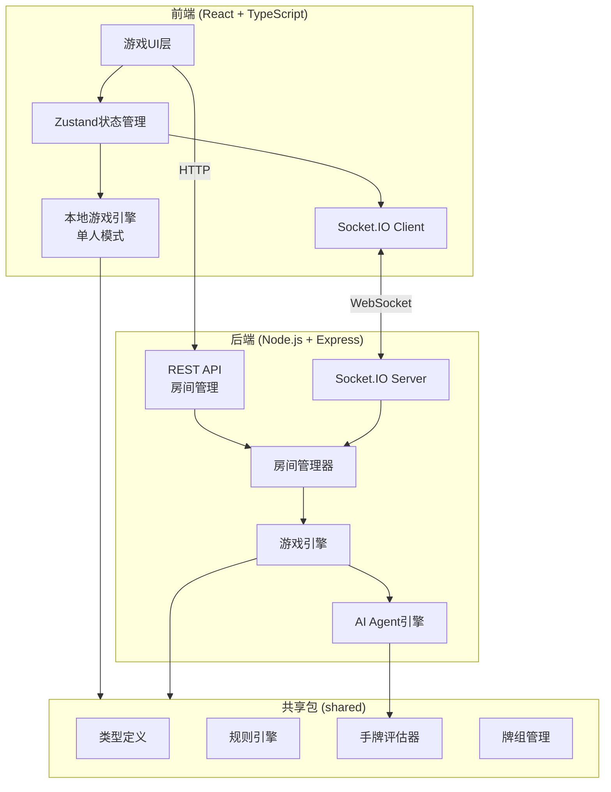
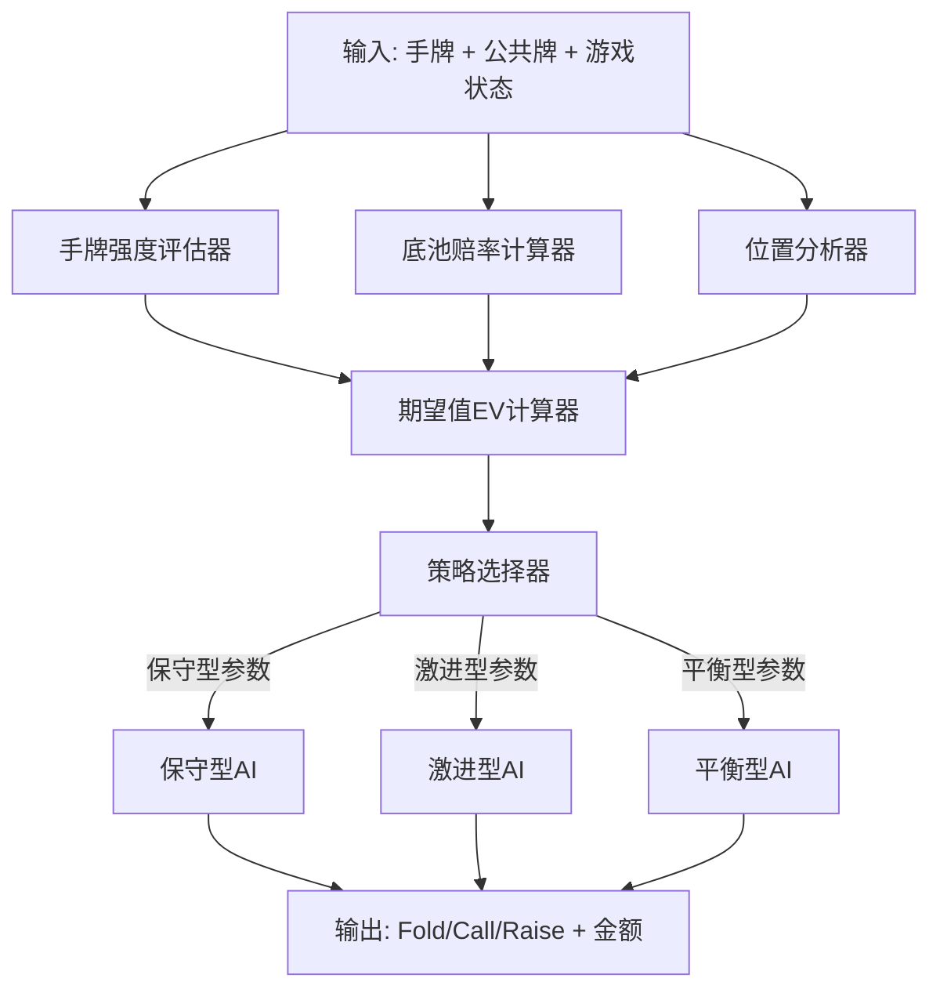
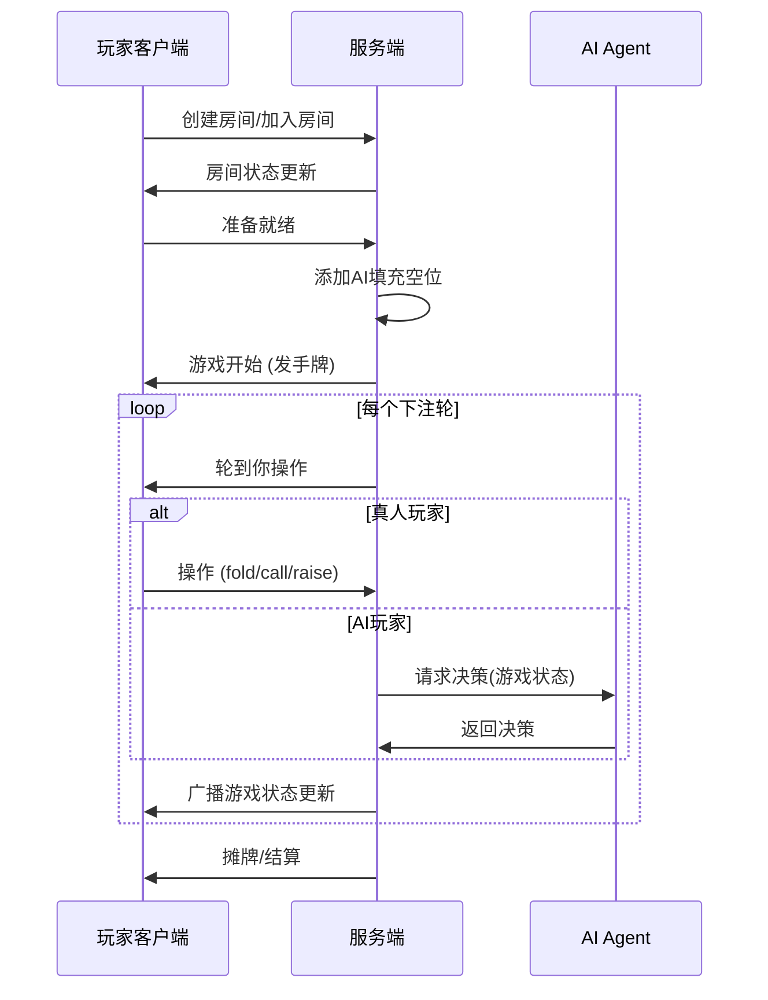

## Product Overview

一款完整的德州扑克(Texas Hold'em Poker)网页游戏，支持单人与AI对战、多人在线联机对战，以及混合模式（真人+AI电脑玩家）。电脑玩家具备智能Agent决策能力，能根据牌面局势、底池赔率、手牌强度等因素做出合理的跟注(Call)、加注(Raise)或弃牌(Fold)决策。

## Core Features

1. **游戏大厅**：支持选择单人模式（vs AI）或多人联机模式，多人模式下可创建/加入房间，设置房间参数（人数、盲注等）
2. **德州扑克牌桌界面**：展示椭圆形牌桌、玩家座位（头像、筹码、手牌）、公共牌区域、底池显示、庄家按钮标记，以及发牌/翻牌动画效果
3. **玩家操作面板**：提供弃牌(Fold)、跟注(Call)、加注(Raise)操作按钮，加注时支持滑块或输入金额，显示当前回合状态与倒计时
4. **完整游戏引擎**：实现标准德州扑克规则，包括Pre-flop、Flop、Turn、River四个阶段，自动发牌、下盲注、比牌判定胜负、分配底池
5. **AI Agent智能决策系统（双方案）**：实现两种AI决策引擎，通过统一AIStrategy接口对接，可在游戏设置中切换——**方案A：规则+概率引擎**（手牌强度评估、底池赔率、EV计算，纯本地<50ms）；**方案B：LLM引擎**（调用大语言模型API，更拟人化决策，超时fallback到规则引擎）；支持多种AI性格（保守型、激进型、平衡型）
6. **多人联机对战**：基于WebSocket实时通信，支持房间创建/加入/退出、游戏状态实时同步、断线重连、人数不足时可补充AI玩家

## Tech Stack

### 前端

- **构建工具**: Vite 5
- **框架**: React 18 + TypeScript
- **样式**: Tailwind CSS 4 + CSS Modules（用于复杂动画）
- **状态管理**: Zustand（轻量、适合游戏状态管理）
- **实时通信**: Socket.IO Client
- **动画**: Framer Motion（发牌、翻牌、筹码动画）
- **组件库**: shadcn/ui（大厅页面、弹窗等通用UI）

### 后端

- **运行时**: Node.js 20+
- **框架**: Express.js + TypeScript
- **WebSocket**: Socket.IO（房间管理、实时游戏状态同步）
- **AI引擎**: 双方案——方案A: 自研规则引擎+概率计算（纯TypeScript）；方案B: LLM引擎（OpenAI兼容API），通过统一AIStrategy接口切换

## Implementation Approach

采用前后端分离架构，通过 monorepo 方式组织代码，前端(client)与后端(server)共享核心游戏逻辑包(shared)。

**核心策略**：

1. **游戏引擎与UI分离**：游戏核心逻辑（发牌、规则判定、手牌评估）抽取到 `shared` 包，前后端共用，避免逻辑重复且确保一致性
2. **单人模式本地运行**：单人模式下游戏引擎直接在浏览器端运行，无需服务器，降低延迟提升体验
3. **多人模式服务端权威**：联机模式下所有游戏逻辑在服务端执行，客户端仅负责渲染和发送操作指令，防作弊
4. **AI Agent双方案决策**：采用策略模式(Strategy Pattern)，定义统一AIStrategy接口——**方案A（规则+概率）**：底层手牌强度评估器，中层EV计算器，顶层策略选择器；**方案B（LLM）**：构造包含牌局信息的prompt调用LLM API，解析结构化JSON决策。两种方案可在游戏设置中切换，LLM超时自动fallback到规则引擎

**关键技术决策**：

- 选择 Socket.IO 而非原生 WebSocket：内置房间管理、自动重连、fallback机制，开发效率高
- 手牌评估算法：采用查表法+位运算的高效手牌评估，O(1)复杂度评估5-7张牌组合
- AI双方案架构：通过统一AIStrategy接口实现策略模式，规则引擎响应快(<10ms)可离线运行，LLM引擎更智能但依赖外部API

## Implementation Notes

1. **共享类型安全**：`shared` 包定义所有游戏类型（Card、Player、GameState、Action等），前后端通过 TypeScript path alias 引用，确保类型一致
2. **AI决策性能**：手牌评估采用预计算的查找表（Lookup Table），避免运行时枚举所有组合；Monte Carlo模拟限制在1000次迭代内，确保决策时间<50ms
3. **WebSocket消息协议**：定义严格的事件类型枚举和payload类型，避免魔法字符串；所有服务端状态变更通过统一的 `gameStateUpdate` 事件广播
4. **动画与状态同步**：使用 Zustand 中间件实现状态变更队列，动画播放完毕后再消费下一个状态更新，避免动画跳帧
5. **安全性**：服务端校验所有玩家操作合法性（是否轮到该玩家、加注金额是否合法等），客户端不信任任何本地计算结果

## Architecture Design

### 系统架构



### AI Agent 决策架构



### 数据流



## Directory Structure

项目采用 monorepo 结构，前端、后端、共享逻辑分离：

```
TexasAgent/
├── package.json                    # [NEW] 根 package.json, workspace 配置
├── tsconfig.base.json              # [NEW] 基础 TypeScript 配置，所有子包继承
├── README.md                       # [NEW] 项目说明文档
│
├── shared/                         # [NEW] 共享游戏核心逻辑包
│   ├── package.json                # [NEW] shared 包配置
│   ├── tsconfig.json               # [NEW] TypeScript 配置
│   └── src/
│       ├── index.ts                # [NEW] 统一导出入口
│       ├── types.ts                # [NEW] 核心类型定义：Card, Suit, Rank, Player, GameState, GamePhase, PlayerAction, Room, SocketEvents 等所有共享类型
│       ├── constants.ts            # [NEW] 游戏常量：手牌排名、盲注结构、默认配置
│       ├── deck.ts                 # [NEW] 牌组管理：创建标准52张牌、洗牌(Fisher-Yates)、发牌
│       ├── hand-evaluator.ts       # [NEW] 手牌评估器：评估5-7张牌的最佳组合，返回手牌等级和排名值。实现皇家同花顺到高牌的所有牌型判定，使用位运算优化性能
│       ├── game-rules.ts           # [NEW] 游戏规则引擎：管理下注轮次、盲注逻辑、最小加注计算、side pot处理、胜负判定和底池分配
│       └── utils.ts                # [NEW] 工具函数：牌面格式化显示、筹码格式化、概率计算辅助
│
├── server/                         # [NEW] 后端服务
│   ├── package.json                # [NEW] 服务端依赖配置（express, socket.io, cors, tsx）
│   ├── tsconfig.json               # [NEW] TypeScript 配置，引用 shared
│   └── src/
│       ├── index.ts                # [NEW] 服务入口：Express + Socket.IO 初始化，CORS配置，端口监听
│       ├── room-manager.ts         # [NEW] 房间管理器：创建/加入/离开房间、房间列表查询、房间状态管理、最大房间数限制
│       ├── game-controller.ts      # [NEW] 游戏控制器：管理单局游戏完整流程——发牌、下注轮流转、超时处理、摊牌结算；调用shared引擎执行规则校验
│       ├── socket-handler.ts       # [NEW] Socket事件处理：注册所有WebSocket事件监听（join-room, player-action, leave-room等），消息验证和广播
│       └── ai/
│           ├── ai-strategy.ts      # [NEW] 统一AI策略接口定义：AIStrategy interface + AIDecisionContext类型 + 策略工厂方法
│           ├── ai-player.ts        # [NEW] AI玩家控制器：接收游戏状态，通过策略模式调用对应引擎，模拟思考延迟（1-3s），返回操作
│           ├── rule-based/
│           │   ├── hand-strength.ts    # [NEW] 手牌强度分析：Monte Carlo模拟胜率估算、outs counting、有效手牌强度(EHS)
│           │   ├── rule-strategy.ts    # [NEW] 规则+概率策略引擎：基于手牌强度+底池赔率+位置计算EV，根据AI性格参数输出决策
│           │   └── personalities.ts    # [NEW] AI性格预设：保守型(Tight-Passive)、激进型(Loose-Aggressive)、平衡型(Tight-Aggressive)参数配置
│           └── llm/
│               ├── llm-strategy.ts     # [NEW] LLM决策策略：调用OpenAI兼容API，解析结构化JSON决策，超时fallback到规则引擎
│               └── prompt-builder.ts   # [NEW] Prompt构造器：将牌局状态（手牌、公共牌、底池、筹码、位置等）格式化为LLM prompt
│
├── client/                         # [NEW] 前端应用
│   ├── package.json                # [NEW] 前端依赖配置（react, vite, tailwindcss, zustand, framer-motion, socket.io-client, shadcn/ui）
│   ├── tsconfig.json               # [NEW] TypeScript 配置，引用 shared，配置 path alias
│   ├── vite.config.ts              # [NEW] Vite 配置：alias设置、代理配置（开发时代理WebSocket到后端）
│   ├── tailwind.config.js          # [NEW] Tailwind 配置：自定义牌桌绿色主题色、扑克相关间距
│   ├── index.html                  # [NEW] HTML 入口
│   ├── postcss.config.js           # [NEW] PostCSS 配置
│   └── src/
│       ├── main.tsx                # [NEW] React 入口，路由配置
│       ├── App.tsx                 # [NEW] 根组件，路由挂载
│       ├── styles/
│       │   └── globals.css         # [NEW] 全局样式：Tailwind指令、牌桌背景纹理、卡牌动画keyframes
│       ├── stores/
│       │   ├── game-store.ts       # [NEW] 游戏状态store：管理GameState、玩家操作、动画队列；单人模式直接调用本地引擎，联机模式通过socket发送
│       │   └── lobby-store.ts      # [NEW] 大厅状态store：房间列表、当前房间信息、连接状态
│       ├── services/
│       │   ├── socket-service.ts   # [NEW] Socket.IO客户端封装：连接管理、事件注册、断线重连、消息类型安全
│       │   └── local-game.ts       # [NEW] 本地游戏引擎服务：单人模式下在浏览器端运行完整游戏逻辑+AI决策
│       ├── pages/
│       │   ├── Lobby.tsx           # [NEW] 游戏大厅页：模式选择（单人/多人）、多人房间列表、创建房间弹窗、加入房间、游戏设置
│       │   └── Game.tsx            # [NEW] 游戏主页面：牌桌场景容器，组合所有游戏组件，管理游戏生命周期
│       └── components/
│           ├── table/
│           │   ├── PokerTable.tsx   # [NEW] 牌桌组件：椭圆形绿色牌桌渲染、公共牌区域、底池显示、庄家按钮位置
│           │   ├── CommunityCards.tsx # [NEW] 公共牌组件：展示翻牌/转牌/河牌，带翻牌动画效果
│           │   └── Pot.tsx          # [NEW] 底池显示组件：显示当前底池总额、side pot信息，筹码堆叠视觉效果
│           ├── player/
│           │   ├── PlayerSeat.tsx   # [NEW] 玩家座位组件：头像、昵称、筹码数、手牌展示（正面/背面）、当前状态标记（庄家/小盲/大盲）、操作高亮
│           │   ├── PlayerCards.tsx  # [NEW] 手牌组件：展示两张手牌，支持正面/背面切换动画、摊牌翻转效果
│           │   └── PlayerAction.tsx # [NEW] 玩家最近操作展示：Fold/Call/Raise气泡提示，短暂显示后淡出
│           ├── controls/
│           │   ├── ActionPanel.tsx  # [NEW] 操作面板：Fold/Call/Raise按钮组，加注金额滑块和输入框，仅在轮到当前玩家时激活，倒计时进度条
│           │   └── BetSlider.tsx    # [NEW] 加注滑块组件：最小加注到全押范围，预设快捷按钮（1/2底池、3/4底池、全押）
│           └── ui/
│               ├── Card.tsx         # [NEW] 扑克牌组件：渲染单张扑克牌（花色+点数），正面/背面状态，CSS翻转动画
│               ├── Chip.tsx         # [NEW] 筹码组件：不同面额筹码的视觉渲染
│               └── GameLog.tsx      # [NEW] 游戏日志组件：显示最近操作记录，可展开/折叠
```

## Key Code Structures

```typescript
// shared/src/types.ts - 核心类型定义

export type Suit = 'hearts' | 'diamonds' | 'clubs' | 'spades';
export type Rank = '2' | '3' | '4' | '5' | '6' | '7' | '8' | '9' | '10' | 'J' | 'Q' | 'K' | 'A';

export interface Card {
  suit: Suit;
  rank: Rank;
}

export type GamePhase = 'waiting' | 'preflop' | 'flop' | 'turn' | 'river' | 'showdown';
export type ActionType = 'fold' | 'check' | 'call' | 'raise' | 'all-in';
export type AIPersonality = 'conservative' | 'aggressive' | 'balanced';

export interface PlayerAction {
  type: ActionType;
  amount?: number; // 仅raise/all-in时有值
}

export interface Player {
  id: string;
  name: string;
  chips: number;
  cards: Card[];
  currentBet: number;
  totalBet: number;
  isActive: boolean;   // 本轮是否还在（未fold）
  isFolded: boolean;
  isAllIn: boolean;
  isAI: boolean;
  aiPersonality?: AIPersonality;
  seatIndex: number;
}

export interface GameState {
  id: string;
  phase: GamePhase;
  players: Player[];
  communityCards: Card[];
  pot: number;
  sidePots: { amount: number; eligiblePlayerIds: string[] }[];
  currentPlayerIndex: number;
  dealerIndex: number;
  smallBlind: number;
  bigBlind: number;
  minRaise: number;
  lastAction?: { playerId: string; action: PlayerAction };
}

export interface RoomConfig {
  maxPlayers: number;     // 2-9
  smallBlind: number;
  bigBlind: number;
  startingChips: number;
  aiCount: number;        // 初始AI数量
  aiDifficulty: AIPersonality;
}
```

## Design Style

采用深色豪华赌场风格，营造沉浸式德州扑克体验。深绿色牌桌搭配暗金色装饰，结合微光效果和流畅动画，呈现高端游戏质感。

## Page Planning

### Page 1: 游戏大厅 (Lobby)

- **顶部导航栏**：游戏Logo（左侧金色"TexasAgent"字样）、玩家头像与筹码余额（右侧）、设置图标
- **模式选择区域**：两张大型卡片并排展示——"单人模式"（扑克牌+AI图标插图，描述"与AI智能对手切磋"）和"多人模式"（多人头像插图，描述"与真人玩家在线对战"），hover时卡片微微上浮并发光
- **多人房间列表区**（选择多人模式后展示）：房间卡片列表，每张卡片展示房间名、当前人数/最大人数、盲注级别、状态标签（等待中/游戏中）；右上角"创建房间"按钮
- **底部信息栏**：在线人数、版本信息

### Page 2: 游戏牌桌 (Game Table)

- **牌桌主区域**：页面中央为椭圆形深绿色牌桌，带木质边框和细微纹理；牌桌中央展示公共牌（最多5张），公共牌下方显示底池金额（金色数字+筹码图标）
- **玩家座位区**：围绕牌桌椭圆分布2-9个座位，每个座位显示：圆形头像（AI玩家有机器人标识）、昵称、筹码数、两张手牌（自己的正面显示/他人背面显示）、当前操作状态气泡、庄家/盲注标记圆形Badge
- **操作面板区**（底部）：轮到玩家操作时从底部滑入——三个主按钮（Fold红色、Call蓝色、Raise金色），加注时展开滑块和快捷金额按钮（1/2 Pot、3/4 Pot、All In），上方显示倒计时进度条
- **游戏信息侧栏**（右侧可折叠）：当前回合阶段指示器、最近操作日志滚动列表、返回大厅按钮

### Page 3: 创建房间弹窗 (Modal)

- **弹窗标题**："创建房间"，金色下划线装饰
- **设置表单**：房间名称输入框、最大玩家数下拉选择(2-9)、盲注级别选择（小/中/大）、起始筹码滑块、AI玩家数量调节器、AI难度选择（保守/激进/平衡，带性格描述tooltip）
- **底部操作**：取消与确认创建按钮

## Animation Design

- **发牌动画**：牌从牌堆位置飞向各玩家座位，有轻微旋转和缩放
- **翻牌动画**：公共牌从背面3D翻转到正面，依次展开
- **筹码动画**：下注时筹码从玩家位置滑向底池中央
- **操作面板**：轮到玩家时底部面板弹性滑入，非操作时滑出
- **胜负结算**：赢家座位金色光晕脉冲效果，底池筹码飞向赢家